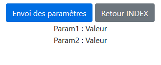
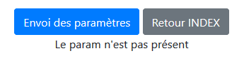

# PHP - Les paramètres d'URL

**Pour les exercices qui suivent** :

- Bien respecter *les normes W3C*.  
- Ne pas oublier le CSS et ajouter une touche de *Bootstrap* dans vos exercices !  

## Exercice 1

Voici l'URL à étudier :  
> **index.php?lastname=Tutor&firstname=Janine**

Faire une page **index.php**.  
Sur cette page faire 2 boutons :

- Le premier "bouton" doit contenir un **href** qui pointe vers l'URL ci-dessus.  
Il faut ensuite tester sur *cette même page* que tous les paramètres existent :
    - S'ils sont présents les afficher.
    - Dans le cas contraire ne rien afficher.
- Le deuxieme "bouton" doit permettre de revenir à la page **index.php**.  

ex. Boutons :  
  

ex. Affichage :  
  

## Exercice 2

Voici l'URL à étudier :  
> **index.php?lastname=Jo&firstname=Bar**

Faire une page **index.php**.  
Sur cette page faire 2 boutons :

- Le premier "bouton" doit contenir un **href** qui pointe vers l'URL ci-dessus. Il faut ensuite tester sur *cette même page* que le paramètre **age** existe :
    - S'il est présent, l'afficher.
    - Dans le cas contraire, mettre un message : *"il manque le paramètre **age**"*.
- Le deuxieme "bouton" doit permettre de revenir à la page **index.php**.  

Affichage :  
 

## Exercice 3

Voici l'URL à étudier :  
> **index.php?startDate=03/26/2021&endDate=24/09/2021**

Faire une page **index.php**.  
Sur cette page faire 2 boutons :

- Le premier "bouton" doit contenir un **href** qui pointe vers l'URL ci-dessus. Il faut ensuite tester sur *cette même page* que tous les paramètres existent :
    - S'ils sont présents, les afficher dans *une phrase indiquant la date de début et de fin de formation*.
    - Dans le cas contraire ne rien afficher.
- Le deuxieme "bouton" doit permettre de revenir à la page **index.php**.  

## Exercice 4

Voici l'URL à étudier :  
> **index.php?language=PHP&server=WAMP**

Faire une page **index.php**.  
Sur cette page faire 2 boutons :

- Le premier "bouton" doit contenir un **href** qui pointe vers l'URL ci-dessus. Il faut ensuite tester sur *cette même page* que tous les paramètres existent :
    - S'ils sont présents, les afficher.
    - Dans le cas contraire afficher un message : Veuiller selectionner "un langage et un environnement de développement".
- Le deuxieme "bouton" doit permettre de revenir à la page **index.php**.  

## Exercice 5

Voici l'URL à étudier :  
> **index.php?day=2&month=6**

Faire une page **index.php**.  
Sur cette page faire 2 boutons :

- Le premier "bouton" doit contenir un **href** qui pointe vers l'URL. Il faut ensuite tester sur *cette même page* que les paramètres **day** et **month** existent:
    - S'ils sont présents, les afficher avec le jour correspondant et le mois correspondants (Lundi = 1, Janvier = 1).
    - Dans le cas contraire ne rien afficher.
- Le deuxieme "bouton" doit permettre de revenir à la page **index.php**.  

## Exercice 6

Voici l'URL à étudier :  
> **index.php?age=17&gender=male**

Faire une page **index.php**.  
Sur cette page faire 2 boutons :

- Le premier "bouton" doit contenir un **href** qui pointe vers l'URL ci-dessus. Il faut ensuite tester sur *cette même page* que tous les paramètres existent :
    - S'ils sont présents, afficher "la fameuse phrase correspondante".
    - Dans le cas contraire ne rien afficher.
- Le deuxieme "bouton" doit permettre de revenir à la page **index.php**.
